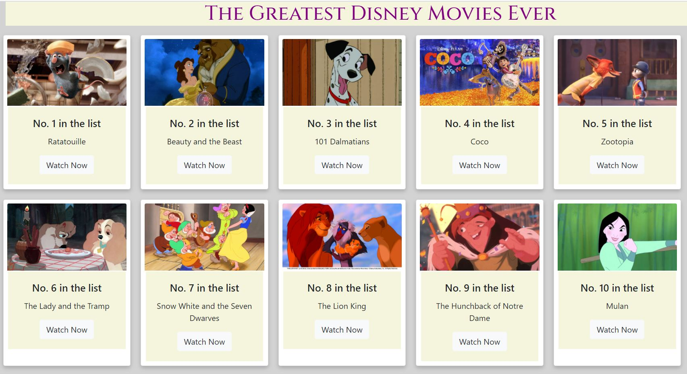

# Disney Movies App

This project is made with react trying to showcase simple props and map method.

## Instructions

- In this app, the user can see the top 10 disney movies in the cards
- The cards are placed using the prop function and the data is retreived using the map function
- The react-bootstrap is used to design the placement of row
- The watch now button will be directed to the movie link
- Just click the below link to get started:

https://disney-movies.netlify.app/

## Screenshot

## Technologies used

- React
- React router dom
- React-bootstrap
- Express
- Node
- Google fonts

## Contributing

- Pull requests are welcome. For major changes, please open an issue first to discuss what you would like to change.

## Copyright

Copyright (c) [2020] [Prasamsha Sharma]
